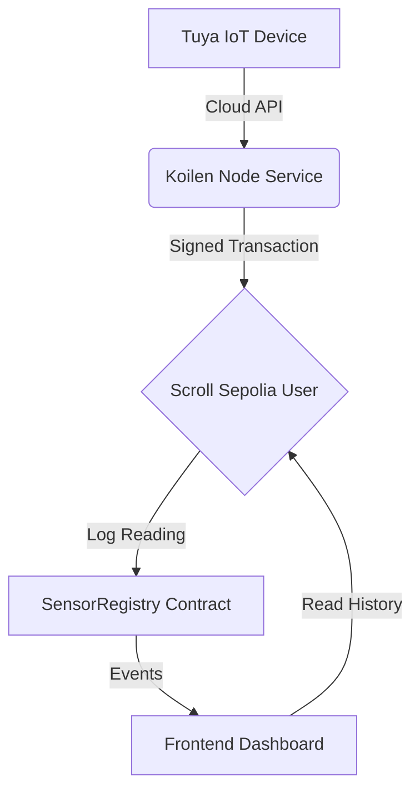

# Koilen Scroll Demo 📜 + 🌡️

> **Immutable IoT Data Logging on Scroll Sepolia**

Koilen bridges the physical world with the blockchain by logging secure, tamper-proof sensor data using Tuya IoT devices and the Scroll Layer 2 network.

---

## 💡 The Problem
Supply chains and critical infrastructure rely on environmental controls, but sensor data usually lives in siloed, centralized servers that can be manipulated. 

## 🛠️ The Solution
**Koilen** provides a decentralized "black box" for IoT data. 
1. **Real-time Capture**: Reads Temperature & Humidity from Tuya-certified devices.
2. **Immutable Storage**: Periodically commits hashes/data to the Scroll blockchain.
3. **Verifiable History**: Anyone can audit the environment history via the smart contract.

## 🏗️ Architecture



## ✨ Key Features
- **Tuya Integration**: Seamless connection to millions of commercial IoT devices.
- **Cost-Effective**: Utilizes Scroll's low gas fees for frequent data logging.
- **Crypto-secure**: Uses local keystore management for automated signing.
- **Visual Dashboard**: Real-time charts (Chart.js) and historical data inspection.

## 💻 Tech Stack
- **Blockchain**: Solidity, Scroll Sepolia Testnet
- **Backend**: Node.js, Ethers.js
- **IoT Provider**: Tuya Cloud API
- **Frontend**: Vanilla JS, Chart.js, Chart.js Date Adapter

## 📜 Smart Contract
**SensorRegistry**: [`0xc26a0053fE1b4849F33409E2ddAC2F9C76484Af9`](https://sepolia.scrollscan.com/address/0xc26a0053fE1b4849F33409E2ddAC2F9C76484Af9)

---

## 🚀 Getting Started

### Prerequisites
- Node.js v16+
- A funded Scroll Sepolia wallet (ETH)
- Tuya Developer Account

### 1. Installation
```bash
git clone https://github.com/mexiweb3/koilen-demo-scroll.git
cd koilen-demo-scroll
npm install
```

### 2. Configuration
Create a `.env` file in the root directory:
```env
# Tuya Cloud Credentials
TUYA_ACCESS_ID=your_access_id
TUYA_ACCESS_SECRET=your_access_secret
TUYA_API_ENDPOINT=https://openapi.tuyaus.com
DEVICE_ID=your_device_id

# Wallet Security
KEYSTORE_PASSWORD=your_keystore_password
```
*Note: Place your encrypted JSON keystore file (e.g., `UTC--...`) in the root folder.*

### 3. Usage

**Run the Data Logger (Backend)**
```bash
# Single log
node koilen-service.js

# Daemon mode (runs every 30s)
node koilen-service.js loop
```

**Run the Dashboard (Frontend)**
```bash
npx http-server frontend -p 8080 -c-1
```
Visit `http://localhost:8080` to see your data.

---

## 👥 Team
- **[Diego Benitez]**: [cofounder/[LinkedIn](https://www.linkedin.com/in/benitezconcha/)]
- **[Mauricio Cruz - Mexi]**: [cofounder/[LinkedIn](https://www.linkedin.com/in/mauricio-cruz-65b124163/)]

## 📄 License
MIT
